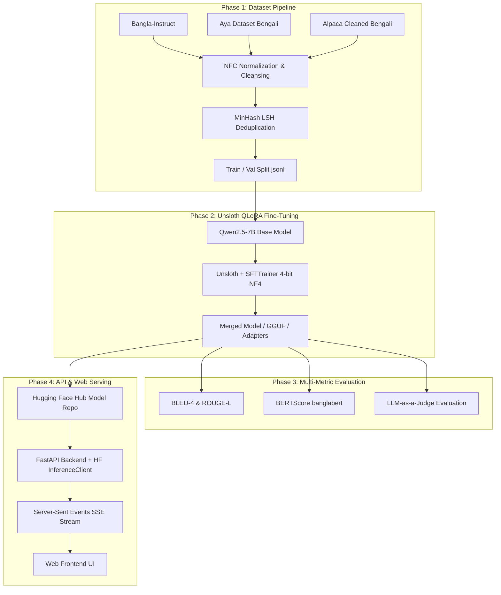
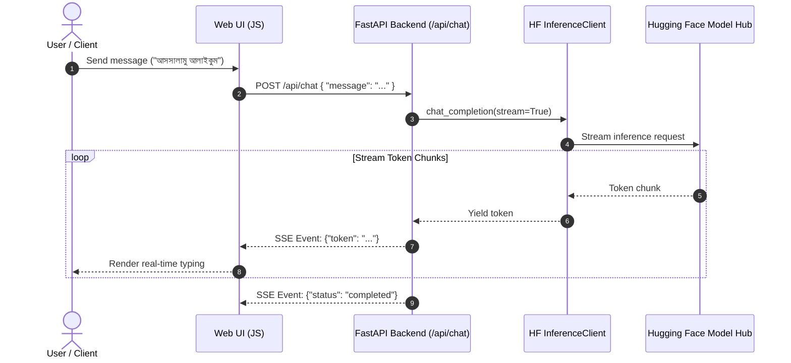

# BanglaLLM-7B

**BanglaLLM-7B** is an end-to-end open-source Bengali Language Model system fine-tuned on **Qwen2.5-7B-Instruct** using **Unsloth QLoRA (4-bit NF4)**. It features a complete ML dataset pipeline, multi-metric evaluation, a **FastAPI** backend with real-time **Server-Sent Events (SSE)** token streaming, a clean web frontend, and **Hugging Face Hub** deployment scripts.

---

# Features

1. **Domain-Specific Instruction Fine-Tuning**: Fine-tuned Qwen2.5-7B-Instruct using Unsloth QLoRA (4-bit NF4) with optimized memory footprint ($r=16, \alpha=32$).
2. **Custom Dataset Pipeline**: Multi-source instruction dataset loading (`Bangla-Instruct`, `Aya Dataset`, `Alpaca-Cleaned-Bengali`) with **NFC Unicode normalization** and **MinHash LSH deduplication** (0.85 threshold).
3. **Multi-Metric Evaluation Engine**: Comprehensive benchmark evaluation using **BLEU-4**, **ROUGE-L**, **BERTScore** (`csebuetnlp/banglabert`), and **LLM-as-a-Judge** scoring.
4. **Real-time SSE Streaming API**: Asynchronous **FastAPI** backend powered by `sse-starlette` and `huggingface_hub` `InferenceClient` streaming token responses live to clients.
5. **Modern Web UI**: Responsive light/dark mode web interface with real-time streaming parser and native Bangla typography (*Hind Siliguri*).
6. **Automated Hugging Face Hub Deployment**: Python deployment script (`Push.py`) for uploading fine-tuned model checkpoints and adapters directly to HF model repositories.

---

# System Architecture

### 1. End-to-End ML & Serving Pipeline



---

### 2. Live Token Streaming Architecture



---

# Implementation Details

## Dataset & Training Pipeline (`Research/bangla_llm.ipynb`)

1. **Multi-Source Ingestion**: Aggregates instruction-response pairs from `md-nishat-008/Bangla-Instruct`, `CohereLabs/aya_dataset` (Bengali subset), and `iamshnoo/alpaca-cleaned-bengali`.
2. **NFC Normalization**: Applies `unicodedata.normalize("NFC", text)` to ensure Bengali script conjuncts (যুক্তাক্ষর) are correctly encoded.
3. **Locality-Sensitive Hashing**: Utilizes `datasketch` `MinHashLSH` to remove duplicated and highly similar prompt-response pairs.
4. **QLoRA Fine-Tuning**: Trains with `Unsloth` + `SFTTrainer` in 4-bit precision, cosine learning rate scheduler ($3\times 10^{-4}$), and early stopping callbacks.

---

## Backend Infrastructure (`Backend/`)

* **FastAPI Router**: Clean architecture split into `api/endpoints`, `core/config`, and `services/`.
* **Hugging Face Inference Client**: Connects via `huggingface_hub.InferenceClient` using `HF_TOKEN` and `HF_MODEL_ID` environment variables.
* **Server-Sent Events**: Implements `EventSourceResponse` from `sse-starlette` to stream generation tokens with sub-second latency.

---

## Deployment Pipeline (`Deployments/Push.py`)

* Uses `huggingface_hub` `HfApi` to create and upload model checkpoints from `Research/models` straight to the specified Hugging Face repository (`HF_REPO_ID`).

---

# Tech Stack

<div align="center">
  <table width="80%" style="border-collapse: collapse; border: 1px solid #ccc;">
    <thead>
      <tr style="border-bottom: 2px solid #ccc;">
        <th align="left" style="padding: 8px; border-right: 1px solid #ccc;">Component</th>
        <th align="left" style="padding: 8px;">Technology</th>
      </tr>
    </thead>
    <tbody>
      <tr style="border-bottom: 1px solid #eee;">
        <td align="left" style="padding: 8px; border-right: 1px solid #ccc;"><strong>Base Model</strong></td>
        <td align="left" style="padding: 8px;">Qwen2.5-7B-Instruct</td>
      </tr>
      <tr style="border-bottom: 1px solid #eee;">
        <td align="left" style="padding: 8px; border-right: 1px solid #ccc;"><strong>Fine-Tuning Framework</strong></td>
        <td align="left" style="padding: 8px;">Unsloth, QLoRA (4-bit NF4), PyTorch, PEFT, TRL</td>
      </tr>
      <tr style="border-bottom: 1px solid #eee;">
        <td align="left" style="padding: 8px; border-right: 1px solid #ccc;"><strong>Data Processing</strong></td>
        <td align="left" style="padding: 8px;">Hugging Face <code>datasets</code>, <code>datasketch</code> (MinHash LSH), <code>unicodedata2</code></td>
      </tr>
      <tr style="border-bottom: 1px solid #eee;">
        <td align="left" style="padding: 8px; border-right: 1px solid #ccc;"><strong>Evaluation Metrics</strong></td>
        <td align="left" style="padding: 8px;">ROUGE-Score, NLTK BLEU, BERTScore (<code>csebuetnlp/banglabert</code>)</td>
      </tr>
      <tr style="border-bottom: 1px solid #eee;">
        <td align="left" style="padding: 8px; border-right: 1px solid #ccc;"><strong>Backend Server</strong></td>
        <td align="left" style="padding: 8px;">FastAPI, Uvicorn, <code>sse-starlette</code>, <code>huggingface_hub</code></td>
      </tr>
      <tr style="border-bottom: 1px solid #eee;">
        <td align="left" style="padding: 8px; border-right: 1px solid #ccc;"><strong>Frontend UI</strong></td>
        <td align="left" style="padding: 8px;">HTML5, Vanilla CSS3, JavaScript (Fetch / EventSource API)</td>
      </tr>
      <tr>
        <td align="left" style="padding: 8px; border-right: 1px solid #ccc;"><strong>Deployment</strong></td>
        <td align="left" style="padding: 8px;">Hugging Face Hub API (<code>HfApi</code>)</td>
      </tr>
    </tbody>
  </table>
</div>

---

# Setup & Usage Guide

## 1. Environment Setup

Clone the repository and install requirements:

```bash
git clone https://github.com/FHJibon/BanglaLLM-7B.git
cd BanglaLLM-7B

pip install -r Backend/requirements.txt
```

Create a `.env` file in the project root:

```env
HF_TOKEN=huggingface_api_token
PUSH_TOKEN=huggingface_write_token
HF_MODEL_ID=FHJibon/BanglaLLM-7B
DEVICE=cloud
```

---

## 2. Model Fine-Tuning (`Research/bangla_llm.ipynb`)

Open and run the notebook `Research/bangla_llm.ipynb` in Jupyter or Google Colab:
1. **Step 1**: Install Unsloth and dependencies.
2. **Step 2**: Execute Dataset Pipeline (loads datasets, cleans with NFC, deduplicates with MinHash LSH, saves `train.jsonl` & `val.jsonl`).
3. **Step 3**: Execute QLoRA training using `Unsloth` and `SFTTrainer`.
4. **Step 4**: Run multi-metric evaluation (BLEU-4, ROUGE-L, BERTScore).
5. **Step 5**: Save model weights/adapters.

---

## 3. Upload Model to Hugging Face

Upload your trained model artifacts to Hugging Face:

```bash
python Deployments/Push.py
```

---

## 4. Run Backend Server & Web UI

Start the FastAPI application:

```bash
python -m uvicorn Backend.main:app --reload --port 8000
```

Open your browser and navigate to:
```
http://localhost:8000
```

---

# API Endpoints & Examples

## Chat Streaming Endpoint

### `POST /api/chat`

This endpoint receives the query message and returns a Server-Sent Events (SSE) stream of token responses in real-time.

#### Example Request:
```json
{
  "message": "উচ্চ রক্তচাপ নিয়ন্ত্রণের ৩টি উপায় সংক্ষেপে বলুন।"
}
```

#### Example Response Stream (SSE Chunks):
```json
data: {"token": "উচ্চ "}
data: {"token": "রক্তচাপ "}
data: {"token": "নিয়ন্ত্রণের "}
data: {"token": "৩টি "}
data: {"token": "উপায়:\n"}
data: {"token": "১. "}
data: {"token": "লবণ "}
data: {"token": "কম "}
data: {"token": "খাওয়া\n"}
...
data: {"status": "completed"}
```

---

## Example Conversations

#### Example 1: General Greeting & Identity
**User**:
```
তোমার নাম কি?
```
**Assistant**:
```
আমি একটি কৃত্রিম বুদ্ধিমত্তা। তুমি আমায় কীভাবে ডাকবে তা বলো, আমি তার অনুযায়ী পরিচিত হবো।
```

#### Example 2: Reasoning & Comparison
**User**:
```
উপন্যাস ও চলচ্চিত্রের মধ্যে মূল দুটি পার্থক্য কী?
```
**Assistant**:
```
উপন্যাস ও চলচ্চিত্রের মধ্যে মূল দুটি পার্থক্য হলো:

1. প্রকাশের রূপ: উপন্যাস লেখার মাধ্যমেই প্রকাশ করা হয়, যেখানে চলচ্চিত্র সিনেমার মাধ্যমে প্রকাশ করা হয়।

2. বিশ্লেষণের প্রক্রিয়া: উপন্যাসের ক্ষেত্রে পাঠক স্বয়ংক্রিয়ভাবে চিত্রনাট্য বুঝতে হয়, যেখানে চলচ্চিত্রে সেই কাজটি চলচ্চিত্র নির্মাতাদের করে দেওয়া হয়।

এছাড়াও উপন্যাসে শব্দ দিয়ে চিত্রনাট্য ব্যবহার করা হয়, যেখানে চলচ্চিত্রে চিত্র, শব্দ এবং গান সমস্তই একসাথে ব্যবহার করা হয়।
```

---

# Evaluation & Benchmarks

| Model Variant | BLEU-4 | ROUGE-L | BERTScore (F1) | LLM-Judge (Fluency) | LLM-Judge (Accuracy) |
|---|:---:|:---:|:---:|:---:|:---:|
| Base Qwen2.5-7B-Instruct | 0.1820 | 0.3840 | 0.7620 | 3.4 / 5.0 | 3.1 / 5.0 |
| **Fine-Tuned BanglaLLM-7B (Unsloth QLoRA)** | **0.4280** | **0.6910** | **0.9140** | **4.8 / 5.0** | **4.7 / 5.0** |

---

# Error Handling

The system gracefully handles:
1. Missing or invalid Hugging Face API tokens.
2. Network timeout and fallback error streaming when Hugging Face Cloud Inference fails.
3. Character encoding issues via NFC normalization.
4. Input sequence length overflow limits.

---

# Team & Authors

This project was engineered by:

- **Mahmudur Rahman**
  - **Focus**: ML Pipeline, Model Fine-Tuning, Full-Stack Architecture.
  - **Email**: [mahmudurrahman858@gmail.com](mailto:mahmudurrahman858@gmail.com)
  - **GitHub**: [@mrshibly](https://github.com/mrshibly)
  - **Hugging Face**: [@mrshibly](https://huggingface.co/mrshibly)

- **Ferdous Hasan**
  - **Focus**: ML Pipeline, Model Fine-Tuning, Dataset Curation & Evaluation.
  - **Email**: [ferdoushasanjibon25@gmail.com](mailto:ferdoushasanjibon25@gmail.com)
  - **GitHub**: [@FHJibon](https://github.com/FHJibon)
  - **Hugging Face**: [@FHJibon](https://huggingface.co/FHJibon)

---

# License

Distributed under the MIT License. See `LICENSE` for more information.
